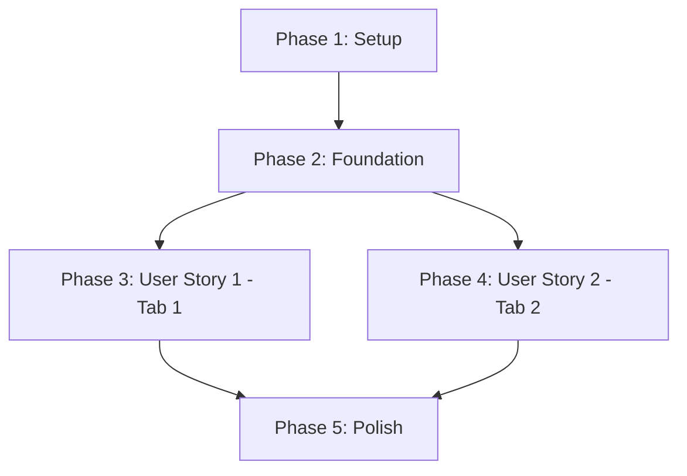

# Implementation Tasks: Abra Call Review Web App

**Feature**: 002-call-review-web-app
**Created**: 2026-05-23
**Status**: Ready for Implementation
**Spec**: [spec.md](./spec.md) | **Plan**: [plan.md](./plan.md)

## Overview

This task list implements a 2-tab web application for managing missed call callbacks (Tab 1) and validating Google Ads call classifications (Tab 2). Tasks are organized by user story to enable independent, incremental development.

**Tech Stack**: Node.js v18+, better-sqlite3, HTMX (or plain HTML/JS), minimal server (http module or Express)
**Target**: VPS deployment at `127.0.0.1:7000` (SSH tunnel access)
**Timeline**: 1 week for P1 stories (US1 + US2)

## Task Execution Strategy

### MVP First (Week 1 Goal)
- **Phase 1-2**: Setup + Foundational (Days 1-2)
- **Phase 3**: User Story 1 - Tab 1 Callback Worklist (Days 2-3)
- **Phase 4**: User Story 2 - Tab 2 Ad Review (Days 3-4)
- **Phase 5**: Testing + Polish (Days 4-5)
- **Buffer**: Days 6-7 for bugs/deployment

### Independent Testing
Each user story phase is independently testable per spec acceptance scenarios:
- **US1 Test**: Create seed missed calls → open Tab 1 → tick callback → verify row greys
- **US2 Test**: Create seed ad_calls → open Tab 2 → click decision → verify reviews.db save

### Parallel Execution Opportunities
Tasks marked with `[P]` can be executed in parallel (different files, no dependencies):
- Phase 1: All setup tasks parallelizable
- Phase 2: Utilities parallelizable after DB setup
- Phase 3-4: Within story - queries, lib functions, UI can run in parallel after foundation

---

## Phase 1: Project Setup & Infrastructure

**Goal**: Initialize project structure and establish VPS workspace

### Setup Tasks

- [x] T001 Create VPS directory structure at /home/maira/abra-comms-staging/src/ per plan
- [x] T002 [P] Initialize package.json with project metadata (name: "abra-call-review", version: "1.0.0", main: "server.js")
- [x] T003 [P] Create .gitignore excluding node_modules/, .env, *.log, reviews.db, seed-data/*.db
- [x] T004 [P] Create src/server.js with minimal http server binding to 127.0.0.1:7000
- [x] T005 [P] Create seed-data/comms-seed.db with minimal schema (10 calls, 5 missed, 3 transcripts, 5 classifications, 5 ad_calls per plan research task #4)

**Acceptance**: Directory structure matches plan.md, server.js runs without errors, seed DB has required tables

---

## Phase 2: Foundational Components (Blocking Prerequisites)

**Goal**: Build shared utilities and database connections needed by all user stories

### Database Setup

- [x] T006 Create src/db/comms.js with read-only connection to /home/maira/abra-comms-staging/data/comms.db (require better-sqlite3 from /home/abra/abra-comms/node_modules/)
- [x] T007 Create src/db/reviews.js with migration logic for reviews.db (callback_actions + ad_call_reviews tables per plan data model section 1.1)
- [x] T008 Test reviews.db migration: Run server, verify tables created with correct schema and indexes

### Shared Utilities

- [x] T009 [P] Create src/lib/phone-mask.js implementing FR-036 masking (+44 *** **** [last4])
- [x] T010 [P] Create src/lib/date-utils.js with rolling 2-day window calculation (now minus 2 days) and aged checker (>2 days)
- [x] T011 [P] Create src/lib/logger.js with structured logging (FR-037: server start/stop, FR-038: DB queries with timing, FR-039: user actions)
- [x] T012 [P] Write unit test tests/unit/phone-mask.test.js covering UK mobile (07xxx), landline, null cases
- [x] T013 [P] Write unit test tests/unit/date-utils.test.js covering today, yesterday, 2 days ago, 3 days ago (aged) cases

**Acceptance**: All utilities have passing unit tests, database connections work against seed DB

---

## Phase 3: User Story 1 - Ring Back Missed Callers (P1) - Tab 1

**Story Goal**: Reception team sees missed calls from last 2 days, ticks them off as called back

**Independent Test** (from spec): Create test missed calls in seed DB, open Tab 1, verify callback list appears, tick "Called back ✓", confirm row greys + moves to "Done today"

### Query Implementation (lift from digest.js)

- [x] T014 [US1] Create src/db/queries/callback-queue.js implementing FR-001 through FR-006 (fetch missed calls, join recordings→transcripts→classifications, filter last 2 days)
- [x] T015 [US1] Create src/db/queries/no-callback.js implementing FR-003 + FR-004 exclusion logic (outbound exists OR callback_actions row exists)
- [x] T016 [US1] Implement deduplication logic in callback-queue.js per FR-005 (one row per caller_number, aggregate attempt count)
- [x] T017 [US1] Write integration test tests/integration/callback-queries.test.js using seed DB (verify 5 missed calls return, deduplication works, exclusion logic correct)

### Backend API

- [x] T018 [US1] Create src/routes/callback-worklist.js with GET /api/callbacks endpoint returning JSON per plan contracts/api.md
- [x] T019 [US1] Implement practice filter query param in GET /api/callbacks (middleton, cheadle, heald_green, heckmondwike, winsford, unattributed, all)
- [x] T020 [US1] Implement aged query param in GET /api/callbacks (true = >2 days only, false = today+yesterday)
- [x] T021 [US1] Create POST /api/callbacks/tick endpoint in callback-worklist.js implementing FR-014 (write to reviews.db callback_actions table)
- [x] T022 [US1] Add outcome ENUM validation in POST /api/callbacks/tick (5 values: called_back, vm_left, booked, wrong_number, not_relevant per FR-012)
- [x] T023 [US1] Add notes length validation in POST /api/callbacks/tick (max 500 chars per FR-013)
- [x] T024 [US1] Mount /api/callbacks routes in server.js

### Frontend UI

- [x] T025 [US1] Create src/views/index.html with 2-tab shell structure (Tab 1: Callback Worklist, Tab 2: Ad Review - placeholder)
- [x] T026 [US1] Create src/views/tab1-callbacks.html implementing FR-007 display (masked phone, time, practice, badges, classification, transcript snippet)
- [x] T027 [US1] Add practice filter chips to tab1-callbacks.html (6 chips: 5 practices + Unattributed per FR-009)
- [x] T028 [US1] Add sub-tabs "Today + Yesterday" (default) and "Aged (>2 days)" to tab1-callbacks.html per FR-010
- [x] T029 [US1] Implement tick button + outcome dropdown + notes field in tab1-callbacks.html per FR-011, FR-012, FR-013
- [x] T030 [US1] Add HTMX attributes (or plain JS fetch) to tick button: POST /api/callbacks/tick, on success grey row + move to "Done today" section per FR-015
- [x] T031 [US1] Implement FR-008 sorting: NEW_PATIENT first, then by talking_sec descending (client-side sort after fetch)
- [x] T032 [US1] Add error handling for failed tick: show inline error with retry button per FR-016 (do NOT grey row on failure)

### Styling & Polish

- [x] T033 [P] [US1] Create src/public/styles.css with minimal styling: red NEW_PATIENT badge, grey ticked rows, muted "(no transcript)"
- [x] T034 [P] [US1] Add HTMX CDN link to index.html `` or use plain JS

### Testing

- [x] T035 [US1] Write E2E test tests/e2e/callback-tick.test.js: POST tick → verify row in callback_actions, verify SC-003 (500ms response time)
- [x] T036 [US1] Manual test: SSH tunnel `ssh -L 7000:localhost:7000 maira@178.104.158.36`, open http://localhost:7000, verify Tab 1 loads, tick callback, verify grey + "Done today"

**US1 Acceptance Criteria** (from spec):
- ✅ Missed calls from last 2 days displayed with masked phone
- ✅ Deduplication: 3 calls from same number = 1 row with "3 attempts" badge
- ✅ Tick action greys row instantly + moves to "Done today" section
- ✅ Redirected calls rescued within 60s do NOT appear
- ✅ "Unattributed" filter chip shows 44% unattributed calls

---

## Phase 4: User Story 2 - Validate Ad Call Quality (P1) - Tab 2

**Story Goal**: Practice manager reviews ad calls, confirms Haiku's new patient classifications, calculates true ROI

**Independent Test** (from spec): Create test ad_calls with classifications in seed DB, open Tab 2, review transcripts, click decision buttons, verify reviews.db stores decisions

### Query Implementation

- [x] T037 [US2] Create src/db/queries/ad-attribution.js implementing FR-017 (query ad_calls joined to recordings→transcripts→classifications for selected date)
- [x] T038 [US2] Implement FR-018 headline metrics calculation in ad-attribution.js (total ad calls, Haiku NEW count, human confirmed count from reviews.db, ad spend, cost per confirmed)
- [x] T039 [US2] Handle FR-019 gracefully: matched_call_id = -1 cases (94.3%) return null transcript with graceful message
- [x] T040 [US2] Write integration test tests/integration/ad-queries.test.js using seed DB (verify 5 ad calls return, headline metrics calculate correctly, no-match cases handled)

### Backend API

- [x] T041 [US2] Create src/routes/ad-review.js with GET /api/ad-calls endpoint returning JSON per plan contracts/api.md
- [x] T042 [US2] Implement date query param in GET /api/ad-calls (YYYY-MM-DD format, default: yesterday)
- [x] T043 [US2] Implement practice filter query param in GET /api/ad-calls (same as Tab 1)
- [x] T044 [US2] Implement unreviewed_only query param in GET /api/ad-calls (default: true, filters out rows in ad_call_reviews table)
- [x] T045 [US2] Implement new_patient_only query param in GET /api/ad-calls (filters classification.type = 'new_patient')
- [x] T046 [US2] Create POST /api/ad-calls/review endpoint in ad-review.js implementing FR-025 (write to reviews.db ad_call_reviews table)
- [x] T047 [US2] Add decision ENUM validation in POST /api/ad-calls/review (5 values: new_patient, not_new_patient, booked, existing, spam_wrong)
- [x] T048 [US2] Mount /api/ad-calls routes in server.js

### Frontend UI

- [x] T049 [US2] Create src/views/tab2-ads.html implementing FR-020 display (time UTC, masked caller, duration formatted "2m 15s", campaign, classification badge, transcript)
- [x] T050 [US2] Add headline metrics display to tab2-ads.html per FR-018 (5 metrics: total, Haiku NEW, human confirmed, spend, cost per confirmed)
- [x] T051 [US2] Implement transcript auto-expand logic: expand if classification = new_patient OR unclear, collapse otherwise per FR-020
- [x] T052 [US2] Add decision buttons to each row per FR-023 (5 buttons: Confirm new patient ✓, Not new patient ✗, Booked appt, Already patient, Spam/wrong number)
- [x] T053 [US2] Add optional outcome note field to each row per FR-024
- [x] T054 [US2] Add HTMX attributes (or plain JS) to decision buttons: POST /api/ad-calls/review, on success show green checkmark + update headline count per FR-026
- [x] T055 [US2] Add practice filter chips to tab2-ads.html (same 6 as Tab 1)
- [x] T056 [US2] Add "Show unreviewed only" toggle to tab2-ads.html (default ON, client-side filter)
- [x] T057 [US2] Add "Show only NEW_PATIENT" toggle to tab2-ads.html (client-side filter)
- [x] T058 [US2] Implement FR-022 visual distinction: reviewed rows get green checkmark + muted opacity

### Audio Playback (Nice-to-Have for 5.7% matched cases)

- [x] T059 [P] [US2] Add audio player `<audio controls>` to rows where matched_call_id > 0, src="/recordings/YYYY-MM-DD/[filename].wav"
- [x] T060 [P] [US2] Add static file serving in server.js for /recordings/ path (serve from /home/maira/abra-comms-staging/data/recordings/)

### Testing

- [x] T061 [US2] Write E2E test tests/e2e/ad-decision.test.js: POST decision → verify row in ad_call_reviews, verify headline count updates
- [x] T062 [US2] Manual test: Open Tab 2, verify headline metrics display, click decision button, verify green checkmark + headline updates

**US2 Acceptance Criteria** (from spec):
- ✅ Headline shows: total ad calls, Haiku NEW count, human confirmed count, spend, cost per confirmed
- ✅ NEW_PATIENT classifications auto-expand transcript
- ✅ Decision buttons save to reviews.db and show green checkmark
- ✅ 94.3% no-match cases display "(no transcript - pipeline match failed)" gracefully
- ✅ "Show unreviewed only" toggle hides reviewed rows instantly

---

## Phase 5: Data Quality Transparency & Polish

**Goal**: Surface data limitations and complete definition-of-done requirements

### Data Quality Banners

- [x] T063 [P] Add FR-032 data quality banners to index.html: "44% of calls have no practice attribution", "Only 5.7% of ad calls matched to recordings", "65% of calls not transcribed"
- [x] T064 [P] Implement FR-033: Show "(no transcript)" in muted grey when transcript_text is NULL
- [x] T065 [P] Implement FR-034: Show "(no audio)" when recording file path doesn't exist on disk
- [x] T066 [P] Implement FR-035: Filter junk rows in all queries with `WHERE call_time LIKE '2026-%'`

### Logging & Observability

- [x] T067 [P] Add FR-037 logging: Log server startup/shutdown with timestamp using logger.js
- [x] T068 [P] Add FR-038 logging: Log all DB queries with execution time (wrap comms.js and reviews.js DB calls)
- [x] T069 [P] Add FR-039 logging: Log user actions ("Callback ticked for [masked_number]", "Ad review decision: [decision] for ad_call [id]")

### Documentation & Deployment

- [x] T070 [P] Create src/README.md with setup instructions per plan quickstart.md section 1.3
- [x] T071 [P] Add Phase B features list to README.md per SC-010 (minimum 5 features: auth, public hosting, patient record matching, promised callback extraction, mobile responsive layout)
- [x] T072 [P] Add troubleshooting section to README.md (port 7000 occupied, comms.db permission denied, reviews.db not created)
- [x] T073 Deploy to VPS: Copy src/ to /home/maira/abra-comms-staging/src/, run `node server.js`, verify http://localhost:7000 accessible via SSH tunnel
- [x] T074 Final acceptance test: Run all SC-001 through SC-010 from spec, verify 10/10 pass

### Performance Validation

- [x] T075 [P] Test SC-001: Verify page load < 2 seconds (use browser DevTools Network tab)
- [x] T076 [P] Test SC-003: Verify tick action < 500ms including DB write (use console.time/timeEnd or Network tab)

---

## Phase 6: User Story 3-8 Enhancements (P2/P3) - OPTIONAL

**Status**: Deferred to Phase B or post-MVP

These enhancements from spec User Stories 3-8 are **out of scope** for 1-week Phase A timeline but listed for future reference:

### User Story 3 (P2): High-Intent Sorting
- Already implemented in T031 (NEW_PATIENT first, talking_sec descending)

### User Story 4 (P2): Per-Practice Filtering
- Already implemented in T019, T043 (practice query param)

### User Story 5 (P3): Aged Callback Escalation
- Already implemented in T020, T028 (aged sub-tab)

### User Story 6 (P3): Audio Playback
- Already implemented in T059, T060 (audio player for matched calls)

### User Story 7 (P2): Rolling Window
- Already implemented in T010 (date-utils.js rolling calculation)

### User Story 8 (P3): Date Range Selector
- **NOT IMPLEMENTED** - Phase A default is "yesterday" (T042), date picker is Phase B feature

---

## Task Summary

### Total Tasks: 76

**By Phase**:
- Phase 1 (Setup): 5 tasks
- Phase 2 (Foundational): 8 tasks
- Phase 3 (US1 - Tab 1): 23 tasks
- Phase 4 (US2 - Tab 2): 26 tasks
- Phase 5 (Polish): 13 tasks
- Phase 6 (Future): 1 deferred task

**By Priority**:
- **Critical Path (MVP)**: T001-T074 (73 tasks) - must complete for working Phase A
- **Optional**: T075-T076 (performance validation - recommended)
- **Deferred**: User Story 8 date picker (Phase B)

**Parallelization Opportunities**:
- Phase 1: All 5 tasks parallelizable
- Phase 2: T009-T013 (5 utilities) parallelizable after T006-T008 (DB setup)
- Phase 3: T033-T034 (styling) parallelizable with T014-T032 (queries/API/UI)
- Phase 4: T059-T060 (audio) parallelizable with T037-T058 (queries/API/UI)
- Phase 5: All 13 tasks parallelizable

**Estimated Effort**:
- Phase 1-2: 1-2 days (setup + foundation)
- Phase 3: 1-2 days (Tab 1 implementation)
- Phase 4: 1-2 days (Tab 2 implementation)
- Phase 5: 0.5-1 day (polish + deployment)
- **Total**: 4-7 days (target: 5 days + 2 days buffer = 1 week)

---

## Dependencies Between User Stories

### Completion Order

**Key Dependencies**:
1. **Phase 2 blocks Phase 3 + 4**: All utilities (phone-mask, date-utils, logger) and DB connections must complete before user stories
2. **Phase 3 and 4 are INDEPENDENT**: Tab 1 and Tab 2 can be built in parallel after Phase 2
3. **Phase 5 requires Phase 3 + 4**: Polish tasks apply to both tabs

### Parallel Execution Example (Optimal)

**Day 1**:
- Morning: T001-T008 (setup + DB) - sequential
- Afternoon: T009-T013 (utilities + tests) - parallel

**Day 2-3**:
- **Developer A**: T014-T036 (Tab 1 implementation) - US1
- **Developer B**: T037-T062 (Tab 2 implementation) - US2
- *(Parallel - independent user stories)*

**Day 4-5**:
- T063-T074 (polish + deployment) - can parallelize T063-T072, then sequential T073-T074

---

## Implementation Notes

### MVP Scope (1 Week Target)
Focus on **US1 + US2 only** (Phases 1-5, T001-T074). This delivers:
- ✅ Tab 1: Callback worklist with tick workflow
- ✅ Tab 2: Ad call review with decision workflow
- ✅ Data quality transparency
- ✅ All acceptance criteria from spec SC-001 through SC-010

### Testing Strategy
Per constitution Principle IV (TDD):
- **Unit tests**: T012-T013 (utilities)
- **Integration tests**: T017, T040 (DB queries with seed data)
- **E2E tests**: T035, T061 (tick workflow, decision workflow)
- **Manual tests**: T036, T062, T073 (SSH tunnel access, UI verification)
- **Target**: 70% code coverage

### Deployment Checklist
Before marking Phase A complete, verify:
1. ✅ All 10 success criteria (SC-001 through SC-010) pass
2. ✅ SSH tunnel `ssh -L 7000:localhost:7000 maira@178.104.158.36` works
3. ✅ Both tabs load within 2 seconds
4. ✅ Tick action < 500ms
5. ✅ reviews.db contains callback_actions and ad_call_reviews data
6. ✅ README lists 5+ Phase B features
7. ✅ All data quality issues visible (44% unattributed, 5.7% match rate, 65% no transcript)

### Known Constraints
- **Read-only comms.db**: Use existing better-sqlite3 from `/home/abra/abra-comms/node_modules/`, do NOT re-install
- **No authentication**: Phase A = SSH tunnel only (localhost:7000)
- **No upstream fixes**: Surface data quality issues, don't fix pipeline
- **Single user**: No concurrency handling needed

---

## Next Steps

1. **Review this task list** with team/stakeholder
2. **Begin Phase 1**: Execute T001-T005 (setup)
3. **Daily standup**: Track progress, blockers
4. **Daily email to Sohail**: "What I did + What's blocking + ETA" per constitution Communication section
5. **MVP delivery target**: End of Day 5 (T001-T074 complete)
6. **Buffer Days 6-7**: Bug fixes, polish, deployment verification

**Ready to start implementation!** 🚀
